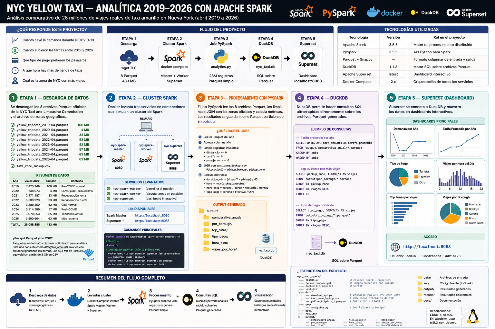
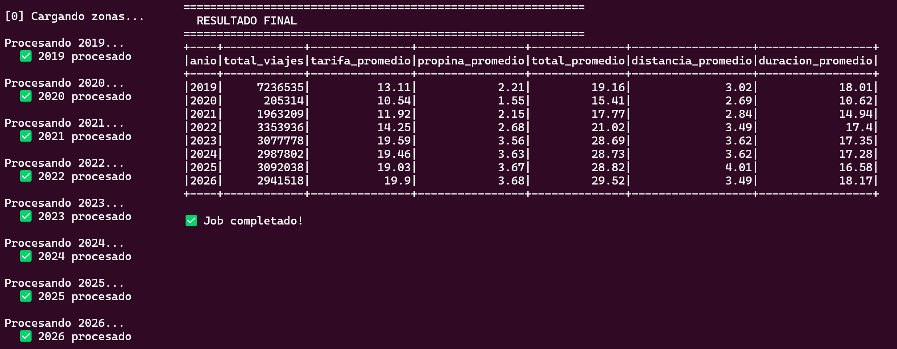
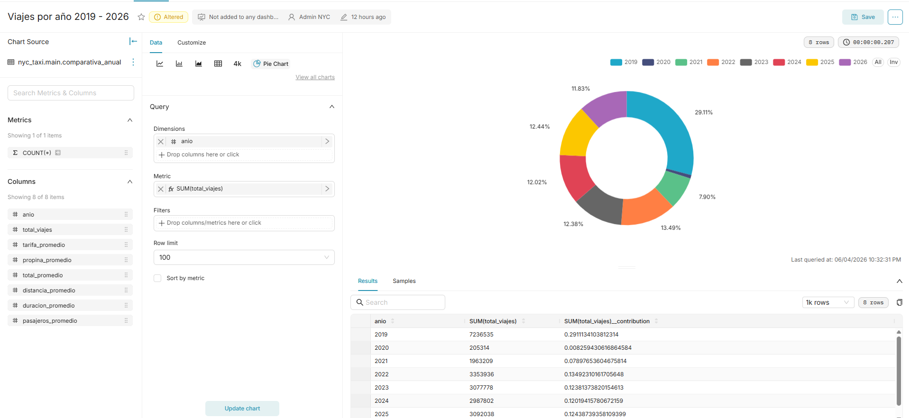

# NYC Yellow Taxi — Analítica 2019-2026 con Apache Spark


SPARK
Ingeniería de datos
Análisis comparativo de 28 millones de viajes reales de taxi amarillo
en Nueva York durante el mes de abril de 2019 a 2026.

> Recomendado: Linux o macOS. En Windows usar WSL2 con Ubuntu.

---

## Que hace este proyecto

La NYC Taxi and Limousine Commission (TLC) publica mensualmente los
registros de todos los viajes de taxi amarillo en Nueva York. Este
proyecto descarga esos datos, los procesa con Apache Spark y genera
un dashboard interactivo en Apache Superset que responde:

- Cuanto cayo la demanda durante el COVID-19
- Cuanto subieron las tarifas entre 2019 y 2026
- Que tipo de pago prefieren los pasajeros
- A que hora hay mas demanda de taxis
- Cual es la zona de NYC con mas viajes

---

## Diagrama de diseno del sistema


---

## Tecnologias

| Tecnologia | Version | Rol en el proyecto |
|---|---|---|
| Apache Spark | 3.5.5 | Motor de procesamiento distribuido |
| PySpark | 3.5.5 | API Python para Spark |
| Parquet + Snappy | — | Formato columnar de entrada y salida |
| DuckDB | 1.1.3 | Motor SQL sobre archivos Parquet |
| Apache Superset | latest | Dashboard interactivo |
| Docker Compose | 2.x | Orquestacion de todos los servicios |


---

## Análisis de Tradeoffs del Stack Tecnológico

📊 [Ver presentación HTML](https://darig7w7.github.io/nyc-taxi-spark/Presentacion%20de%20los%20tradeoffs.html)


---

## Estructura del proyecto

```
nyc_taxi_spark/
├── README.md
├── docker-compose.yml           # Cluster Spark + Superset
├── Dockerfile.superset          # Imagen Superset con DuckDB
├── .gitignore
├── data/
│   ├── download_api.py          # Descarga via API NYC Open Data
│   ├── taxi_zone_lookup.csv     # 265 zonas oficiales de NYC
│   └── yellow_tripdata_*.parquet  # Datos TLC - descargar en ETAPA 1
├── src/
│   └── analytics.py             # Job PySpark principal
├── docs/
├── results/
└── output/                      # Generado al correr - ETAPA 3
    ├── comparativa_anual/
    ├── por_borough/
    ├── top_rutas/
    ├── tipo_pago/
    ├── hora_pico/
    ├── viajes_por_hora/
    └── nyc_taxi.db
```

---

## Requisitos previos

### Docker

```bash
# Ubuntu / Linux
curl -fsSL https://get.docker.com | sh
sudo usermod -aG docker $USER
newgrp docker
sudo service docker start
```

Verifica:
```bash
docker --version
docker compose version
```

> En Windows instala Docker Desktop desde https://www.docker.com/get-started

### Python 3 y wget

```bash
# Ubuntu / Linux
sudo apt update && sudo apt install python3 python3-pip wget -y
```

---

## ETAPA 1 — Descarga de datos

En esta etapa se descargan los 8 archivos Parquet oficiales de la
NYC Taxi and Limousine Commission y el archivo de zonas geograficas.

Por que Parquet y no CSV: Parquet es un formato columnar optimizado
para analitica. Para una consulta como AVG(fare_amount) solo lee esa
columna ignorando todas las demas. Los 433 MB en Parquet equivaldrian
a mas de 2 GB en CSV.

```bash
cd data

wget "https://d37ci6vzurychx.cloudfront.net/trip-data/yellow_tripdata_2019-04.parquet"
wget "https://d37ci6vzurychx.cloudfront.net/trip-data/yellow_tripdata_2020-04.parquet"
wget "https://d37ci6vzurychx.cloudfront.net/trip-data/yellow_tripdata_2021-04.parquet"
wget "https://d37ci6vzurychx.cloudfront.net/trip-data/yellow_tripdata_2022-04.parquet"
wget "https://d37ci6vzurychx.cloudfront.net/trip-data/yellow_tripdata_2023-04.parquet"
wget "https://d37ci6vzurychx.cloudfront.net/trip-data/yellow_tripdata_2024-04.parquet"
wget "https://d37ci6vzurychx.cloudfront.net/trip-data/yellow_tripdata_2025-04.parquet"
wget "https://d37ci6vzurychx.cloudfront.net/trip-data/yellow_tripdata_2026-04.parquet"
wget "https://d37ci6vzurychx.cloudfront.net/misc/taxi_zone_lookup.csv"

cd ..
```

Verifica:
```bash
ls -lh data/*.parquet
```

Datos descargados:

| Año | Viajes Abril | Tamaño | Contexto |
|---|---|---|---|
| 2019 | 7,475,949 | 106 MB | Pre-COVID normal |
| 2020 | 238,073 | 4 MB | COVID peak — caida del 97% |
| 2021 | 2,171,187 | 33 MB | Recuperacion lenta |
| 2022 | 3,599,920 | 53 MB | Recuperacion fuerte |
| 2023 | 3,288,250 | 52 MB | Casi normal |
| 2024 | 3,514,289 | 57 MB | Post-COVID |
| 2025 | 3,970,553 | 65 MB | Tendencia actual |
| 2026 | 3,800,664 | 63 MB | Mas reciente |
| Total | 28,058,885 | 433 MB | |

---

## ETAPA 2 — Levantar el cluster

En esta etapa Docker levanta tres servicios en contenedores:

- nyc-spark-master: coordina la distribucion del trabajo
- nyc-spark-worker: ejecuta las tareas en paralelo
- nyc-superset: dashboard interactivo — se configura en ETAPA 5

Por que Docker: En produccion Spark corre en cientos de servidores
fisicos. Docker simula ese cluster en una sola maquina usando
contenedores aislados.

### Iniciar Docker si no esta corriendo:

```bash
sudo service docker start
```

### Levantar los servicios:

```bash
docker compose up spark-master spark-worker superset -d
```

Espera 2-3 minutos. Verifica:
```bash
docker ps
```

Debes ver 3 contenedores corriendo.

UIs disponibles:
```
Spark Master: http://localhost:8080
Superset:     http://localhost:8088
```

### Inicializar Superset — solo la primera vez:

```bash
docker exec -it nyc-superset superset fab create-admin \
    --username admin \
    --firstname Admin \
    --lastname NYC \
    --email admin@nyc.com \
    --password admin123

docker exec -it nyc-superset superset db upgrade
docker exec -it nyc-superset superset init
```

---

## ETAPA 3 — Procesamiento con PySpark

En esta etapa el job PySpark lee los 8 archivos Parquet, los limpia,
hace JOIN con las zonas oficiales de NYC y calcula las metricas.
Los resultados se guardan como Parquet particionado en output/.

Que hace el job internamente:
```
Para cada año 2019 a 2026:
  1. Lee el Parquet del año
  2. Agrega columna anio
  3. Limpia registros invalidos:
     - distancia <= 0
     - tarifa <= 0
     - pasajeros <= 0
  4. JOIN con taxi_zone_lookup.csv
     PULocationID -> pickup_borough, pickup_zone
  5. Calcula metricas:
     - duration_min = (dropoff - pickup) / 60
     - hora = hour(pickup_datetime)
     - hora_pico = manana/tarde/mediodia/normal
     - tipo_pago = Tarjeta/Efectivo/Otro
Al final combina todos los años y guarda Parquet
```

Por que Spark y no pandas: Con 28 millones de registros pandas en
una sola maquina puede quedarse sin memoria. Spark distribuye el
trabajo entre Workers procesando en RAM completando el analisis
en minutos.

### Ejecutar el job:

```bash
docker compose up spark-job
```

### Salida esperada:

```
============================================================
  NYC YELLOW TAXI — ANALISIS 2019-2026
============================================================
[0] Cargando zonas...
Procesando 2019... OK 2019 procesado
Procesando 2020... OK 2020 procesado
Procesando 2021... OK 2021 procesado
Procesando 2022... OK 2022 procesado
Procesando 2023... OK 2023 procesado
Procesando 2024... OK 2024 procesado
Procesando 2025... OK 2025 procesado
Procesando 2026... OK 2026 procesado

RESULTADO FINAL
+----+------------+---------------+----------------+--------------+
|anio|total_viajes|tarifa_promedio|propina_promedio|total_promedio|
+----+------------+---------------+----------------+--------------+
|2019|   7,236,535|          13.11|            2.21|         19.16|
|2020|     205,314|          10.54|            1.55|         15.41|
|2021|   1,963,209|          11.92|            2.15|         17.77|
|2022|   3,353,936|          14.25|            2.68|         21.02|
|2023|   3,077,778|          19.59|            3.56|         28.69|
|2024|   2,987,802|          19.46|            3.63|         28.73|
|2025|   3,092,038|          19.03|            3.67|         28.82|
|2026|   2,941,518|           19.9|            3.68|         29.52|
+----+------------+---------------+----------------+--------------+
Job completado!
```


Verifica los resultados:
```bash
ls output/
```

---

## ETAPA 4 — Base de datos DuckDB

En esta etapa se crea la base de datos DuckDB que conecta los
archivos Parquet con Apache Superset para visualizacion.

Que es DuckDB: Motor SQL analitico embebido que lee archivos Parquet
directamente sin necesidad de importarlos. Es el puente entre los
resultados de Spark y el dashboard de Superset.

```bash
docker exec -i nyc-superset /app/.venv/bin/python << 'EOF'
import duckdb

con = duckdb.connect('/app/output/nyc_taxi.db')

tablas = {
    'comparativa_anual': '/app/output/comparativa_anual',
    'tipo_pago':         '/app/output/tipo_pago',
    'hora_pico':         '/app/output/hora_pico',
    'por_borough':       '/app/output/por_borough',
    'top_rutas':         '/app/output/top_rutas',
}

for tabla, path in tablas.items():
    con.execute(f"CREATE OR REPLACE TABLE {tabla} AS SELECT * FROM read_parquet('{path}/**/*.parquet')")
    count = con.execute(f"SELECT COUNT(*) FROM {tabla}").fetchone()[0]
    print(f"OK {tabla}: {count} filas")

con.close()
print("Base de datos lista!")
EOF
```

Salida esperada:
```
OK comparativa_anual: 8 filas
OK tipo_pago: 24 filas
OK hora_pico: 32 filas
OK por_borough: 40 filas
OK top_rutas: 1000 filas
Base de datos lista!
```

---

## ETAPA 5 — Dashboard en Apache Superset

En esta etapa se conecta Superset con DuckDB y se crean los
dashboards interactivos para explorar los resultados visualmente.

Que es Apache Superset: Plataforma de Business Intelligence open
source creada por Airbnb en 2015. Es la alternativa gratuita a
Tableau y Power BI — usada en produccion por Netflix, Lyft y Dropbox.

### Paso 1 — Abre Superset:

```
http://localhost:8088
Usuario:  admin
Password: admin123
```

### Paso 2 — Conecta DuckDB:

```
Settings -> Database Connections -> + Database
Selecciona: DuckDB
Connection string: duckdb:////app/output/nyc_taxi.db
Clic: Test Connection -> Connect
```

### Paso 3 — Crea los datasets:

```
Data -> Datasets -> + Dataset
Database: DuckDB -> Schema: main
```

Agrega: comparativa_anual, tipo_pago, hora_pico, por_borough, top_rutas

### Paso 4 — Crea los graficos:

Viajes por año:
```
Charts -> + Chart -> Bar Chart
Dataset:  comparativa_anual
X-Axis:   anio (Force Categorical marcado)
Metrics:  SUM(total_viajes)
Save: "Viajes por Año 2019-2026"
```

Tarifa promedio por año:
```
Charts -> + Chart -> Line Chart
Dataset:  comparativa_anual
X-Axis:   anio (Force Categorical marcado)
Metrics:  SUM(tarifa_promedio)
Save: "Tarifa Promedio por Año"
```

Tabla resumen completa:
```
Charts -> + Chart -> Table
Dataset:  comparativa_anual
Columns:  anio, total_viajes, tarifa_promedio,
          propina_promedio, total_promedio
Save: "Resumen Anual"
```

### Paso 5 — Crea el dashboard:

```
Dashboards -> + Dashboard
Nombre: NYC Yellow Taxi 2019-2026
Arrastra los graficos -> Save
```

---

## Resultados e insights

Comparativa abril 2019-2026 (Terminal):



Comparativa abril 2019-2026 (Dashboard):



Impacto COVID-19:
```
Abril 2019 -> 7.2 millones de viajes
Abril 2020 ->   205 mil viajes
Reduccion:  97% menos viajes en pleno COVID
```

Inflacion de tarifas:
```
2019 -> $13.11 tarifa promedio
2026 -> $19.90 tarifa promedio
Aumento: 52% en 7 años
```

Cambio en tipo de pago:
```
2019 -> Tarjeta 72% / Efectivo 27%
2026 -> Tarjeta 84% / Efectivo 14%
Tendencia: cada vez menos efectivo
```

---

## Marco teorico

### Apache Spark

Framework de procesamiento de datos distribuido creado en 2009 en
UC Berkeley. Procesa datos en RAM en vez de disco siendo hasta 100
veces mas rapido que Hadoop MapReduce.

Componentes usados:
- SparkSession: punto de entrada al cluster
- DataFrame: tabla distribuida entre multiples Workers
- Lazy evaluation: Spark optimiza el plan antes de ejecutar
- Acciones: count(), show(), write() disparan la ejecucion real

### PySpark

API de Python para Spark que permite escribir codigo Python que
se ejecuta de forma distribuida en el cluster:

```python
df = spark.read.parquet("data/yellow_tripdata_2026-04.parquet")
df_clean = df.filter(col("fare_amount") > 0)
resultado = df_clean.groupBy("anio").agg(avg("fare_amount"))
resultado.write.parquet("output/comparativa_anual")
```

### Parquet

Formato columnar optimizado para analitica. Solo lee las columnas
necesarias siendo hasta 10x mas rapido que CSV. Los 433 MB en
Parquet equivaldrian a mas de 2 GB en CSV. Incluye compresion
Snappy automatica y guarda el esquema de datos.

### DuckDB

Motor SQL embebido que lee Parquet directamente sin importar datos:

```sql
SELECT anio, AVG(fare_amount)
FROM read_parquet('output/**/*.parquet')
GROUP BY anio ORDER BY anio
```

### Apache Superset

Plataforma BI open source creada por Airbnb. Alternativa gratuita
a Tableau y Power BI con mas de 40 tipos de visualizaciones,
SQL editor integrado y dashboards interactivos.

---

## Spark vs Hadoop MapReduce

| Aspecto | Hadoop MapReduce | Apache Spark |
|---|---|---|
| Procesamiento | En disco | En RAM |
| Velocidad | Lento | Hasta 100x mas rapido |
| API | Java verboso | Python o Scala conciso |
| SQL | Hive lento | Spark SQL nativo |
| ML | No nativo | MLlib integrado |
| Streaming | No nativo | Spark Streaming |
| Formato salida | Texto plano | Parquet columnar |

Para este proyecto Spark es la opcion correcta porque procesa
28 millones de registros con joins filtros y agregaciones en
minutos — algo que con Hadoop requeriria escribir Java verboso
y tardaria mucho mas por escribir en disco entre cada fase.

---
---

## Spark vs Hadoop MapReduce

---

## Preguntas de Discusión

### 1. Diferencia entre un Spark Driver y Spark Workers

* **Spark Driver:** Es el orquestador que lee el código de la aplicación, crea el plan de ejecución y asigna los recursos necesarios. No procesa directamente los grandes volúmenes de datos.

* **Spark Workers (Executors):** Son los nodos encargados de ejecutar las tareas enviadas por el Driver. Procesan los datos distribuidos y almacenan información temporal en memoria para acelerar las operaciones.

**Ejemplo en el caso de transporte:**

El Driver analiza el script PySpark y determina que para ejecutar un `groupBy("city", "route_id")` será necesario redistribuir datos entre nodos mediante un proceso de *shuffle*. Los Workers son los que leen las particiones del archivo `viajes_transporte.csv`, eliminan registros inválidos como distancias negativas (`distance_km >= 0`) y calculan la duración de los viajes utilizando las columnas `start_time` y `end_time`.

---

### 2. ¿Por qué Parquet es útil para analítica?

Parquet es un formato de almacenamiento **columnar** que guarda los datos por columnas en lugar de por filas. Además, almacena metadatos y estadísticas que permiten reducir el volumen de lectura y mejorar significativamente el rendimiento de las consultas analíticas.

**Ventajas principales:**

* Alta compresión de datos.
* Lectura selectiva de columnas.
* Menor consumo de memoria.
* Excelente integración con Apache Spark.

**Ejemplo en el caso de transporte:**

Si un planificador urbano necesita calcular el total de pasajeros de la ciudad de Lima:

```sql
SELECT SUM(total_passengers)
FROM dataset
WHERE city = 'Lima';
```

Parquet permite leer únicamente las columnas necesarias para la consulta e ignorar columnas como `avg_duration_minutes`. Además, gracias al particionado por ciudad y a las estadísticas almacenadas, Spark puede omitir automáticamente bloques completos de datos que no correspondan a Lima.

---

### 3. ¿En qué se diferencia Spark de Hadoop MapReduce?

La principal diferencia está en la forma en que gestionan los datos intermedios durante el procesamiento.

* **Hadoop MapReduce** escribe los resultados intermedios en disco (HDFS) después de cada etapa.
* **Apache Spark** mantiene los resultados intermedios en memoria RAM siempre que sea posible, reduciendo drásticamente los tiempos de ejecución.

| Aspecto                  | Hadoop MapReduce | Apache Spark                 |
| ------------------------ | ---------------- | ---------------------------- |
| Procesamiento intermedio | Disco (HDFS)     | Memoria RAM                  |
| Velocidad                | Menor            | Mucho mayor                  |
| Latencia                 | Alta             | Baja                         |
| Modelo de ejecución      | Map y Reduce     | DAG (Directed Acyclic Graph) |
| Analítica interactiva    | Limitada         | Excelente                    |

**Ejemplo en el caso de transporte:**

Con Hadoop MapReduce, después de limpiar los registros inválidos, los datos serían escritos en disco. Posteriormente serían leídos nuevamente para calcular la duración de los viajes y volverían a guardarse antes de realizar las agregaciones finales.

Con Spark, el DataFrame de viajes limpios permanece en memoria dentro de los Workers. Las operaciones de limpieza, cálculo de duración y agregación se ejecutan de manera encadenada sin escribir en disco hasta el momento final de exportar los resultados en formato Parquet.

---

## Limpieza

```bash
docker compose down
rm -rf output/
```

---

## Fuente de datos

NYC Taxi and Limousine Commission:
```
https://www.nyc.gov/site/tlc/about/tlc-trip-record-data.page
```

Zonas oficiales de NYC:
```
https://d37ci6vzurychx.cloudfront.net/misc/taxi_zone_lookup.csv
```

---

## Autores

-
-
-
-
-
-

## Repositorio

https://github.com/darig7w7/nyc-taxi-spark
